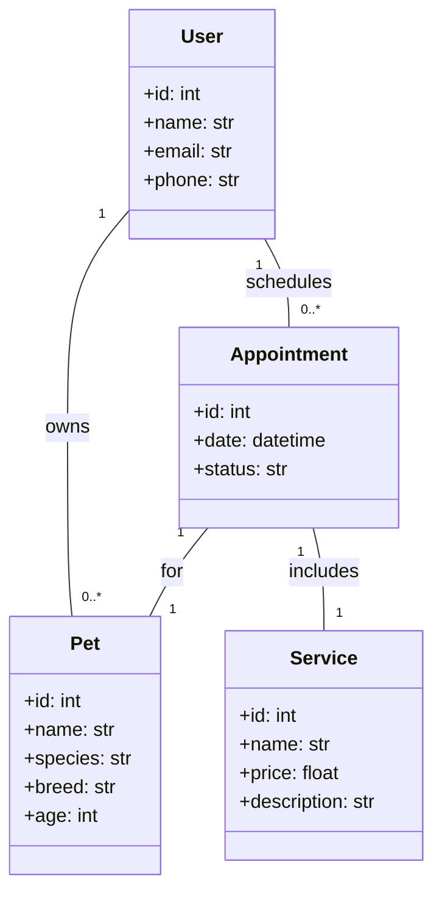

```mermaid

classDiagram
    class User {
        +id: int
        +name: str
        +email: str
        +phone: str
    }

    class Pet {
        +id: int
        +name: str
        +species: str
        +breed: str
        +age: int
    }

    class Appointment {
        +id: int
        +date: datetime
        +status: str
    }

    class Service {
        +id: int
        +name: str
        +price: float
        +description: str
    }

    User "1" -- "0..*" Pet : owns
    User "1" -- "0..*" Appointment : schedules
    Appointment "1" -- "1" Pet : for
    Appointment "1" -- "1" Service : includes
```